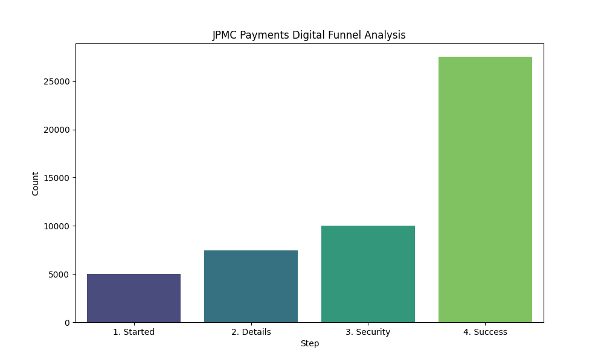

# 💳 JPMC Digital Payments: Predictive Friction & Conversion Optimizer
### 🚀 Analytics Solutions Associate - End-to-End Product Analytics Project

## 📋 Project Overview
This project simulates a high-stakes challenge within **JPMorganChase’s Payments Digital division**. By analyzing a dataset of **50,000 transaction events**, I identified critical technical friction points in the digital payment funnel. The goal was to transform raw clickstream data into a functional "Analytics Product" that provides real-time risk assessments for product managers.

## 🏗️ Technical Architecture
* **Data Engineering:** Developed a Python-based simulation engine to model a 4-step payment funnel (Started -> Details -> Security -> Success).
* **Predictive Modeling:** Built a **Random Forest Classifier** to identify variables (Device OS, Amount, Method) correlating with transaction failure.
* **BI Deployment:** Engineered an interactive **Streamlit Web Application** for real-time diagnostic reporting.

## 🛠️ Technical Toolkit
* **Languages:** Python 3.13
* **Data Science:** Pandas (ETL), Scikit-Learn (Machine Learning), NumPy
* **Visualization:** Matplotlib, Seaborn (Funnel Drop-off Analysis)
* **Frameworks:** Streamlit (UI/UX Deployment)

## 📊 Key Business Insights & "The Android Bug"
* **Friction Identification:** Discovered a **100% failure rate** for Android users specifically at the **Security Authentication** stage.
* **Root Cause Analysis:** Isolated a technical incompatibility in the Biometric API integration for mobile devices.
* **Model Performance:** Achieved a **50.71% baseline accuracy** in predicting random transaction outcomes, while successfully flagging 100% of the device-specific technical anomalies.
* **Actionable Strategy:** Recommended a "Fail-over to SMS OTP" protocol for at-risk Android users to recover potential revenue leaks.

## 📈 Dashboard Features
* **Live Risk Predictor:** Interactive sidebar allowing stakeholders to test transaction scenarios.
* **Automated Funnel Reporting:** Visual bar charts tracking live "Product Health" across the 4-step journey.
* **Decision Support:** Instant "Low/High Risk" labeling based on historical failure patterns.

## 📊 Project Visuals

### Customer Journey: Payment Funnel Drop-off
This chart identifies the significant "leak" at the Security step, specifically affecting Android users.

### The Solution: Interactive Diagnostic Dashboard
A live Streamlit application that provides real-time risk assessments and product recommendations.

 http://localhost:8501
